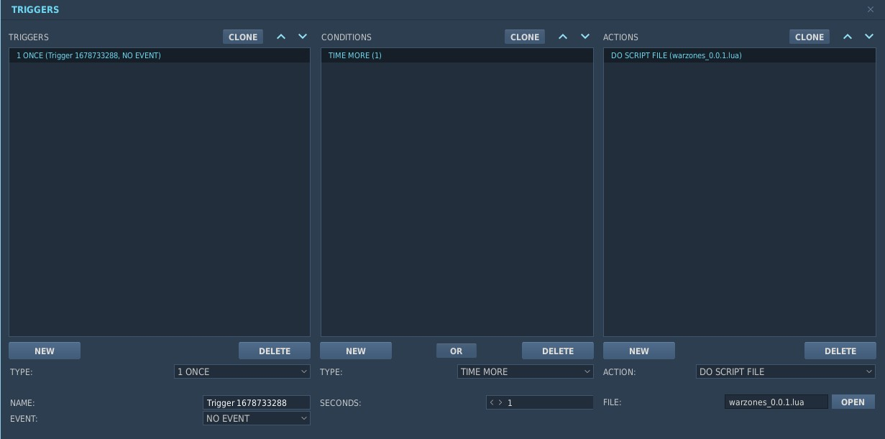

# Digital Combat Simulator "WARZONES"

### Are you searching for a dynamic, persistent, randomized, customizable, simple to install and simple to configure script for your missions? Then D.C.S "WARZONES" may be what you are looking for!

## What is "WARZONES"?

WARZONES is a standalone mission script that works with trigger zones.
The main goal of this script is to provide even the most basic mission designer with the ability to deploy a BLUE player group of choice and have a fully dynamic RED zone with random CAP, moving ground units and SAM Sites in under a couple of minutes.

Starting from here, the mission can be customized further by creating more "warzones" to expand the battlefield or by configuring how these zones will behave in a global manner or individually.

WARZONES is born with persistence in mind. BLUE forces main objective is to deplete RED resources for each zone or to strike vital targets to stop units respawning. The battle progression is automatically saved and restored at each sortie if the DCS "MissionScripting.lua" file is sanitized (more on that on [HOW TO SANITIZE](#how-to-sanitize-my-dcs)).

WARZONES is multiplayer compatible, and runs both on dedicated and local servers even if not completely and properly tested.
It focuses on a PvE BLUE Client vs. RED A.I. scenario, even though it can support RED Clients that can play a defense role.

Being standalone, WARZONES doesn't need any additional framework, but it is fully compatible to be used along with others (Mist, Moose, CTLD,...).
It is also compatible with DSMC to achieve random date or weather swapping (just DISABLE the option to keep spawned units on DSMC special page).

WARZONES will be forever free, but if you feel like it, I will gladly accept a beer from you here: https://www.buymeacoffee.com/pantera93

## How to use "WARZONES"?

Grab the last warzones_x.x.lua release from [HERE](https://github.com/Pantera93/dcs-warzones/releases/). It is a single LUA file.

Enter DCS Mission Editor and create a new mission (or open an existing one). BEWARE! WARZONES uses a randomized function to select which country to assign the spawned groups to, based on the pools available for each coalition defined for the mission. So, if you don't want to find an F-14 flown by the "Italian Social Republic", be sure to set for Blue and Red ONLY the countries you actually want to use, the others must go to NEUTRAL. It's not that it doesn't work, but it will definitely break the immersion.

Create a new TRIGGER ZONE and call it "WAR-WHATEVER_YOU_WANT". The important section is the first 4 characters, "WAR-", what comes after the "-" will be the actual name of the zone in game. Just don't call it "WAR-CONFIG", you'll see later why.

### !!!ONLY CIRCULAR ZONES ARE ALLOWED!!!

Increase the zone size to cover the area where you want to operate (RED units will spawn and move inside the zone perimeter).

Add a new TRIGGER ACTION in the editor to go ONCE, when TIME IS MORE than 1 SECOND, and it has to DO SCRIPT FILE warzones_x.x.lua, just like below:



Place your Blue client/player group, even with AI Wingmen (starting from where and as you want), arm it up and play, that's it!

WELCOME TO WARZONES!

Follow up the next sections to know [WHAT YOU'LL GET](#what-will-basic--warzones--configuration-give-me) and [HOW TO PLAY](#how-should-i-play-warzones). If you are not satisfied with the BASIC configuration of WARZONES, go to the more advanced [HOW TO CONFIGURE](#how-to-configure-warzones) section.

## What will basic "WARZONES" configuration give me?

The basic WARZONES configuration described above automatically gives you a BLUE (Player) vs. RED (Russian sided units) Cold War simulated scenario.

The script will create the necessary configuration as soon as it starts (When mission TIME IS MORE...). After 10 seconds it will launch the first "Zone check" function and create the first batch of RED units for the zone. This first iteration may cause the only performance issue you should experience, since it will spawn a significant number of units in the mission. From now on:

* 1 CAP Group with 2 units will patrol the area and engage every (visible) BLUE air unit inside the zone. Their skill will be randomly picked for each unit from "Rookie" or "Good". The group will be of Mig-19s, Mig-21s, Mirage F-1s, Mig-23s or Mig-29s in a descending probability from first to last. They will be armed for A-A combat according to their arsenal.
* 2 Ground groups with 4 units each will start to move inside the zone in a patrolling fashion. Units will be a mix of light, medium and heavy armored targets, with the probability of having AAA units for self-defense. "Weaker" and "less capable" (trucks) units have higher probability of spawning.
* 2 SAM Nests will be placed in the zone. There's a remote probability to have a SA2 sam site active, or to have a RED ground EWR Radar that will guide red CAP to intercept you. Otherwise, you will face SA8 or SA9 or similar threats.
* 1 BLUE CAP Group on strike frequency 257.000 MHz with 2 units will be patrolling the zone. It will be a group of F4s or F14s. This group will be INVISIBLE and on WEAPONS HOLD until a unit is killed in the zone, or you issue them with the radio command to engage (See "HOW TO PLAY" section).
* 1 INVISIBLE BLUE MQ-9 reaper drone will automatically lase a ground target on laser frequency 1578.
* Some random black smoke effects will be placed in the area

The red resource count is of 6 cap units and 12 ground units. As you destroy units, these numbers are updated accordingly. When an entire group is destroyed and if red resources are still available, a new one will be automatically spawned each minute. SAM groups will not respawn.

Along with units, you will now have access to a "WARZONES" section in the "F10 Other" radio commands. Inside you will find commands to select the zone of interest, check the economic status of the mission (See "HOW TO PLAY" and "HOW TO CONFIGURE") and call functional supports on the zone selected.


Once every minute you will see an HQ report of the selected zone, indicating RED CAP groups positions relative to your group and map coordinates for the first units of the first spawned ground group.


If you added a BLUE Tanker or AWACS to your mission, should they land they will automatically be replaced with same call signs, frequency, route and options you defined in the mission editor for them (This is intended for long-running multiplayer missions).

If you have sanitized your DCS MissionScripting.lua (more on that on [HOW TO SANITIZE](#how-to-sanitize-my-dcs)), once every minute your progress will be saved in the DCS Saved games folder (On Missions -\> WARZONES -\> WARZONES.lua file).

## How should I play WARZONES?

So... now you have a populated battlefield zone crowded with red forces. Your task is to destroy them!

But what's the point of going out and destroying units (except it's fun)? WARZONES gives you the opportunity to enter a battlefield that you don't know anything or very little of and your main objective is to free that zone of enemy presence. Automatic persistence will allow you to, for example, plan a DEAD strike with your buddy with F-16s on a SAM site on Monday night and then go in for CAS in single player with your A-10 to clean the area two days later.

With persistence enabled, RED CAPs and Ground Units are always random at each sortie, but SAM sites positions and killed units are saved.

Each killed unit will decrease RED resources and give you an amount of money to spend on radio supports for the zone(s). With the basic WARZONES configuration, you will be able to:

* Permanently increase the amount of available BLUE CAP groups in the zone (saved for next sorties)
* Pop smoke on ground units and sam sites
* Let the BLUE CAP Groups go weapons free in the area.

If you placed more than one "WAR-" zone you can select which one your group should have reports of and on which one to call supports. Radio commands and messages are multiplayer-synchronized.

The reaper drone will also help you by constantly lasing one unit at a time on laser code 1578.

Now, let's say you finished liberating a zone, and you just landed for a beer... What to do next? DELETE your persistence file and start over, the experience will always be different, I promise! Or try a new map, change the zone position and dimension, add more "WAR-" zones or do anything you want. Or else... go to the next, most complicated but most satisfactory section [HOW TO CONFIGURE](#how-to-configure-warzones)...

## How to configure WARZONES?

The WARZONES environment in a mission can be fine-tuned via configuration. This will give you space to create every kind of mission, from large-scaled multiplayer missions running 24/7 with little effort to a quick training mission with random placed units.

WARZONES configuration is quite simple to perform, but it's maybe hard to understand how every function works.

First of all, to configure WARZONES, you have to add and set its PROPERTIES. This is a mission editor trigger zone section you can find under the zone color picker. for each configuration you want to change, you simply add a property, use a specific name for the "key" (left) field and then input your custom "value" (right) field.

IMAGE

You can configure zones GLOBALLY or INDIVIDUALLY. Specifically, every configuration set in the individual zone will overwrite the global one. Individual configuration is performed directly in each zone, GLOBAL configuration is done via a special WARZONE called "WAR-CONFIG". Placing a trigger zone with this specific name will not use it as a conflict zone, but it will use its configuration properties as a default for every other WARZONE in the mission. It will also give you access to some global-only configurations (the persistence file name to save, for example). The WAR-CONFIG zone is particularly useful for mission with many WARZONES.

Now to the core section of this guide, the table of properties you can use in each zone.

## WARZONES PROPERTIES

### GLOBAL-ONLY PROPERTIES:

| PROPERTY | VALUE | DEFAULT | NOTES |
| --- | --- | --- | --- |
| filename | string | Missions\\WARZONES\\WARZONES.lua | The filename you want your mission progress to be saved in, the root is your DCS Saved Games folder |
| economic_mode | 0 or 1 | 1 | Defines whether the radio zone support commands need the right amount of money to be used or if they are always free to use.<br />"1" sets the money boundaries for supports |
| money | number | 3000 | Starting money for the blue coalition |
| replace_services | 0 or 1 | 1 | Defines whether to automatically respawn user-created BLUE AWACS and Tankers when they land or abort mission (intended for long-running missions).<br />Respawned units will have same route, tasks, frequency, callsign and options as the original one.<br />"1" is respawn enabled |


### GLOBAL-ONLY MONEY-RELATED PROPERTIES:

| PROPERTY         | DEFAULT | NOTES                                                                                                                     |
|------------------|---------|---------------------------------------------------------------------------------------------------------------------------|
| capgain          | 800     | Amount of money received when destroying a RED unit belonging to a CAP Group                                              |
| groundgain       | 150     | Amount of money received when destroying a RED unit belonging to a Ground group                                           |
| samgain          | 200     | Amount of money received when destroying a RED unit belonging to a SAM Group                                              |
| shipgain         | 500     | Amount of money received when destroying a RED unit belonging to a SHIP Group                                             |
| awacsgain        | 1500    | Amount of money received when destroying a RED AWACS unit                                                                 |
| tgtgain          | 1000    | Amount of money received when destroying a RED unit belonging to a ZONE TARGET Group                                      |
| increasecapmoney | 5000    | Money required to permanently increase bluecaplimit in a zone                                                             |
| jtacmoney        | 1500    | Money required to permanently activate Autolase JTAC for the first ground group and the first target zone group in a zone |
| groundcoordmoney | 2000    | Money required to permanently activate coordinates reports for a zone for RED Ground groups moving in the area            |
| tgtcoordmoney    | 2500    | Money required to permanently activate coordinates reports for a zone for ZONE TARGET groups in the area                  |
| awacsmoney       | 2500    | Money required to permanently activate BRA calls in the report for a zone for every RED CAP group in the area             |
| smokemoney       | 800     | Money required to pop smoke in a zone on RED Ground groups, zone targets,  sam sites and ships                            |
| freezonemoney    | 800     | Money required to make BLUE units in a zone VISIBLE and WEAPONS FREE                                                      |
| blueloss         | 0       | Amount of money lost when a BLUE CAP unit or a BLUE Player controlled unit is killed (must be a positive value if used)   |


### GLOBAL AND ZONE-SPECIFIC PROPERTIES:

A special mention here has to be done for "comma separated string" values. These values are meant to create a probability distribution for the values in it. It's better to explain it with an example:

* The value of the field "cap" for a zone is "_M21,MF1_". This means that there's a 50-50% chance to have either a Mig-21 group as next spawn or a Mirage-F1.<br/>
* In another zone, the field value is "_M21_". This means that the only group type spawning for RED CAP is a Mig-21 group.
* In yet another zone, the field value is "_M19,M21,M21,M21,MF1_". This means that there is a 20% (20% x 1) chance to spawn a Mig-19 group, a 60% chance (20% x 3) to spawn a Mig-21 group and a 20% (20% x 1) chance to spawn Mirage-F1.

Commas in these type of fields should not be followed or preceded by spaces (string "_M21, M19_" WILL NOT WORK)

| PROPERTY       | VALUE                   | DEFAULT              | NOTES                                                                                                                                                                                                                                                                                                                                                                                   |
|----------------|-------------------------|----------------------|-----------------------------------------------------------------------------------------------------------------------------------------------------------------------------------------------------------------------------------------------------------------------------------------------------------------------------------------------------------------------------------------|
| template       | "ECW" or "LCW" or "MOD" | LCW                  | The units type template pack to be used in the zone. Setting templates will assign by default the fields cap, bluecap, sam, groundunits and shipunits to simulate an Early Cold War "ECW", Cold War "LCW" or Modern "MOD" scenario. Setting one of the above fields in the zone will remove the template usage.                                                                         |
| invert         | "0" or "1"              | 0                    | When using the template logic, setting invert to "1" will assign cap as bluecap and vice-versa. A special bluesam field in templates is used to assign the sam field.                                                                                                                                                                                                                   |
| cap            | comma separated string  | _empty_              | The probability list of units to be used as RED CAP in the zone. The available values are the ones defined in [CAP TEMPLATES](#cap). Empty string will use defaults.                                                                                                                                                                                                                    |
| bluecap        | comma separated string  | _empty_              | The probability list of units to be used as BLUE CAP in the zone. The available values are the ones defined in [CAP TEMPLATES](#cap). Empty string will use defaults.                                                                                                                                                                                                                   |
| sam            | comma separated string  | _empty_              | The probability list of units to be used as SAM Groups in the zone. The available values are the ones defined in [SAM TEMPLATES](#sam). Empty string will use defaults.                                                                                                                                                                                                                 |
| groundunits    | comma separated string  | _empty_              | The probability list of units to be used as unit types for RED Ground groups in the zone. The available values are the unit type names used in the mission editor. The list of these names is the one find [HERE](https://github.com/mrSkortch/DCS-miscScripts/tree/master/ObjectDB), open the unit.lua file you want to use and copy "typeName" field. Empty string will use defaults. |
| shipunits      | comma separated string  | _empty_              | The probability list of units to be used as unit types for RED Ship groups in the zone. The available values are the unit type names used in the mission editor. The list of these names is the one find [HERE](https://github.com/mrSkortch/DCS-miscScripts/tree/master/ObjectDB), open the unit.lua file you want to use and copy "typeName" field. Empty string will use defaults.                                                                     |
| caplimit       | number                  | 1                    | The limit number of RED CAP groups in the zone                                                                                                                                                                                                                                                                                                                                          |
| captotal       | number                  | 6                    | The limit number of units for RED CAP groups in the zone. Each killed units of RED CAP groups will decrease this value by one                                                                                                                                                                                                                                                           |
| bluecaplimit   | number                  | 1                    | The limit number of BLUE CAP groups in the zone                                                                                                                                                                                                                                                                                                                                         |
| bluecaptotal   | number                  | 100000               | The limit number of units for BLUE CAP groups in the zone. Each killed units of BLUE CAP groups will decrease this value by one                                                                                                                                                                                                                                                         |
| groundlimit    | number                  | 2                    | The limit number of RED Ground groups in the zone                                                                                                                                                                                                                                                                                                                                       |
| groundtotal    | number                  | 12                   | The limit number of units for RED Ground groups in the zone. Each killed units of RED Ground groups will decrease this value by one                                                                                                                                                                                                                                                     |
| shiplimit      | number                  | 0                    | The limit number of RED Ship groups in the zone                                                                                                                                                                                                                                                                                                                                         |
| shiptotal      | number                  | 0                    | The limit number of units for RED Ship groups in the zone. Each killed units of RED Ship groups will decrease this value by one                                                                                                                                                                                                                                                         |
| samlimit       | number                  | 2                    | The limit number of RED SAM groups in the zone                                                                                                                                                                                                                                                                                                                                          |
| samselfdefense | 0 or 1                  | 1                    | "1" will enable the "Engage Air Weapons" option in spawned RED SAM sites for self-defense. "0" will disable it.                                                                                                                                                                                                                                                                         |
| redawacs       | number                  | 0                    | Limit number of respawning A50 RED AWACS systems in the area (always 1 awacs at a time will scan the area)                                                                                                                                                                                                                                                                              |
| redskills      | comma separated string  | Good,Average,Average | Probability list of Skills assigned to RED units. Available values are Average, Good, High, Excellent                                                                                                                                                                                                                                                                                   |
| blueskills     | comma separated string  | Good,Average,Average | Probability list of Skills assigned to BLUE units. Available values are Average, Good, High, Excellent                                                                                                                                                                                                                                                                                  |
| starttype      | "Runway" or "Air"       | Runway               | When spawning RED or BLUE AIR groups, it defines whether to search for the nearest available airfield for the coalition ("Runway") or not ("Air"). If found, groups will start from that airfiled, otherwise they will spawn mid-air in the zone. See more on [RUNWAY START](#runway-start)                                                                                             |
| jtac           | "0" or "1"              | 1                    | Choose whether to activate Autolase JTAC in the zone from the start or not. "1" makes it available from start, "0" needs the related support purchase to have it in the zone.                                                                                                                                                                                                           |
| tgt_coord      | "0" or "1"              | 1                    | Choose whether to activate ZONE TARGETS Report in the zone from the start or not. "1" makes it available from start, "0" needs the related support purchase to have it in the zone.                                                                                                                                                                                                     |
| ground_coord   | "0" or "1"              | 1                    | Choose whether to activate Ground groups Report in the zone from the start or not. "1" makes it available from start, "0" needs the related support purchase to have it in the zone.                                                                                                                                                                                                    |
| awacs_coord    | "0" or "1"              | 1                    | Choose whether to activate AWACS-LIKE Report in the zone from the start or not. "1" makes it available from start, "0" needs the related support purchase to have it in the zone.                                                                                                                                                                                                       |
| big_smoke      | "0" or "1"              | 1                    | "1" fills zone area with random black explosion smoke effects                                                                                                                                                                                                                                                                                                                           |
| bluefreq       | number                  | 257                  | Radio frequency for BLUE spawned units in the zone                                                                                                                                                                                                                                                                                                                                      |
| escalation     | number                  | 100                  | Starting probability threshold to spawn "WEAPONS FREE" or "RETURN FIRE" RED CAP Groups. See more on [ESCALATION](#escalation)                                                                                                                                                                                                                                                           |

## CONFIGURATION CONCEPTS

### ESCALATION

Escalation is a number that simulates a COLD war scenario. When the number is between 0 and 100, it represents the % probability that a newly spawned RED CAP unit is "WEPONS FREE" (and so, engage on sight). This means that an escalation value of 70 gives new RED CAPS a 30% probability to be on "RETURN FIRE" R.O.E.

When any unit of any coalition of any type is killed in a zone (cap, ground, ship, sam, ...) every other unit will automatically get "WEAPONS FREE" option to engage and defend. BLUE Units will also turn VISIBLE in this case.

Every RED killed unit will increase the escalation number by some value (+15 for CAP / AWACS / ZONE TARGETS, +5 for Ground / SAM / Ships)

Above 100, the escalation value will not function (every group will be WEAPONS FREE)

### ZONE TARGETS

Mission designers can manually create and populate groups in the mission editor and use them as TARGET ZONES. When every unit of every specific zone target group is destroyed the zone respawn capability will cease, and it will result as "CONQUERED". This gives WARZONES missions a clear (but still optional) objective.

To use a group as ZONE TARGET, it must be named the same as the zone it belongs to, plus some arbitrary value at the end. For example, a zone target for a zone named "_WAR-Zone_1_" can be named "_WAR-Zone_1_-Tgt_OnE1".

Killed units for ZONE TARGETS are saved with persistence and destroyed at mission start in following sorties.

This function can be used to define additional SAM sites and defences that must be in a specific position and persistently saved.

STATIC OBJECTS ARE NOT SUPPORTED IN THIS VERSION OF WARZONES. AVAILABILITY MAY COME LATER IN DEVELOPMENT.

### SAM PERSISTENCE

SAM Sites do not respawn and are meant to be saved persistently for following sorties. As for zone targets, killed units will be destroyed at mission start.

### SPAWNING POSITION

Spawning and following route points for groups are randomly picked inside the zone area. Air assets will orbit between their second and third waypoint. Similarly, Ground and ship units will travel from waypoint 1 and 2 back and forth.

For ground units, if the random points are picked in the sea, they will be placed on the nearest road. For ships, if the function cannot find 2 points on sea after some attempts, group will not be created until next Zone Check (1 minute).

### RUNWAY START

If "starttype" configuration is "Runway" in a zone, the first random point for an Air (BLUE or RED) group will be use as a pivot to search for the nearest airfield for the corresponding coalition.

To define an airfield as BLUE or RED, mission designers must change airfield coalition from mission editor, or the airfield must be conquered in mission.

Using an airfield as runway is available only for "Airbase" type (no Carriers, no FARPs, no Heliports).

If no airfields are available, the spawning point is automatically set as "Air".

BEWARE! There are airfields that are defined as "Airbase", but don't allow some AI jets to take-off (runway too short). Better not use them as coalition-assigned, or to use "Air" as "starttype" if they have to be used by clients.

## TEMPLATES DEFINITION

### TEMPLATE PACKS

#### _ECW_
```
["cap"] = { "M15","M15","M15", "M15","M19","M19"},
["bluecap"] = { "F86", "F86", "F5" },
["groundunits"] = { "BMP-1", "BMP-1", "T-55", "BMP-1", "T-55",
                    "HL_DSHK", "HL_DSHK", "HL_DSHK", "HL_DSHK", "HL_DSHK", "ZSU_57_2", "ZSU_57_2",
                    "Strela-1 9P31", "Grad-URAL", "SAU Msta", "Scud_B", "ZiL-131 APA-80",
                    "ATZ-5", "ATZ-5", "GAZ-66", "GAZ-66", "GAZ-66", "GAZ-66", "GAZ-66",
                    "UAZ-469", "UAZ-469", "UAZ-469", "UAZ-469", "UAZ-469", "UAZ-469" },
["sam"] = { "AAA", "AAA",  "AAA",  "AAA", "AAA", "AAA", "AAA", "EWR", "SA9", "SA9" },
["bluesam"] = { "AAA", "AAA",  "AAA",  "AAA", "AAA", "AAA", "AAA", "EWR", "NASAM" },
["shipunits"] = { "MOLNIYA", "CastleClass_01", "La_Combattante_II", "CastleClass_01", "La_Combattante_II",
                  "speedboat", "speedboat", "speedboat", "speedboat", "speedboat" }
```

#### _LCW_
```
["cap"] = { "M19","M21","M21","M23","M19","M19","MF1","MF1","M21","M21","M23","M29"},
["bluecap"] = { "F4","F4","F4","F14", "F14", },
["groundunits"] = { "BMP-1", "BMP-1", "T-55", "BMP-1", "T-55",
                    "HL_DSHK", "HL_DSHK", "HL_DSHK", "HL_DSHK", "HL_DSHK", "ZSU_57_2", "ZSU_57_2","ZSU_57_2",
                    "Grad-URAL", "SAU Msta", "Scud_B", "ZiL-131 APA-80",
                    "ATZ-5", "ATZ-5", "GAZ-66", "GAZ-66", "GAZ-66", "GAZ-66", "GAZ-66",
                    "UAZ-469", "UAZ-469", "UAZ-469", "UAZ-469", "UAZ-469", "UAZ-469" },
["sam"] = {  "SA2", "SA8", "SA8", "SA8", "SA8", "SA9","SA13", "SA9", "SA15", "SA15", "EWR" },
["bluesam"] = {  "AAA", "AAA", "EWR", "NASAM", "NASAM", "NASAM", "NASAM" },
["shipunits"] = {  "CastleClass_01", "La_Combattante_II", "speedboat", "speedboat", "speedboat" }
```

#### _MOD_
```
["cap"] = { "M23", "M29", "M29", "M29", "M25", "M25", "M31", "S27", "S27", "S33" },
["bluecap"] = { "F15","F15", "F16", "F16", "F16", "F16", "F18", "F18", "F18", },
["groundunits"] = { "BMP-1", "BMP-1", "T-55", "BMP-1", "T-55",
                    "HL_DSHK", "HL_DSHK", "HL_DSHK", "HL_DSHK", "HL_DSHK", "ZSU_57_2", "ZSU_57_2",
                    "Strela-1 9P31", "Grad-URAL", "SAU Msta", "Scud_B", "ZiL-131 APA-80",
                    "ATZ-5", "ATZ-5", "GAZ-66", "GAZ-66", "GAZ-66", "GAZ-66", "GAZ-66",
                    "UAZ-469", "UAZ-469", "UAZ-469", "UAZ-469", "UAZ-469", "UAZ-469" },
["sam"] = { "SA10", "SA11","SA11", "SA2", "SA2", "SA6", "SA6", "SA6", "SA8", "SA8",
            "SA8", "SA8", "SA8", "SA8", "SA8", "SA15", "SA15", "EWR" },
["bluesam"] = { "NASAM","NASAM","NASAM","NASAM","NASAM","NASAM","EWR","HAWK","HAWK",},
["shipunits"] = { "MOLNIYA", "CastleClass_01", "La_Combattante_II", "CastleClass_01", "La_Combattante_II",
                  "speedboat", "speedboat", "speedboat", "speedboat", "speedboat" }
```


### UNITS

(DCS Missions with unit templates will be created to illustrate units arsenal)

#### _CAP_

* F15
* F86
* F5
* F4
* F14
* F16
* F18
* MF1
* M29
* M23
* M21
* M19
* M15
* M25
* M31
* S27
* S33

#### _SAM_

* SA11
* SA6
* SA2
* SA8
* SA10
* SA3
* SA13
* SA15
* SA9
* AAA
* EWR
* NASAMS
* HAWK

## What's the future of WARZONES?

WARZONES is a work of passion and a product of free time and so will remain forever.

I will gladly receive your feedback and bug reports and I will do the best I can to upgrade and fix the base version, but don't expect a stable schedule of releases.

Actual plans are:

* Increase number and variety of templates (add WW2 planes)
* Add helicopters, CAS flights and SEAD flights as BLUE support or RED forces
* Add Static objects support for ZONE TARGETS
* Add possibility to define custom group templates from editor and use them in probability lists
* If possible, support squared-shaped zones

## How to sanitize my DCS?

To enable persistence you should sanitize your MissionScripting.lua file in your DCS installation folder. Inside it there is a folder called Scripts. Inside that there is a file called MissionScripting.lua, if you want persistence to work, edit this file (make a backup first if you like) and edit the section that looks like this:

```
do
    sanitizeModule('os')
    sanitizeModule('io')
    sanitizeModule('lfs')
    require = nil
    loadlib = nil
end
```

To have this instead:

```
do
    sanitizeModule('os')
    --sanitizeModule('io')
    --sanitizeModule('lfs')
    require = nil
    loadlib = nil
end
```

At each DCS Update this file will be overwritten to the default sanitized state, hence disabling your persistence capabilities.

## GREETINGS

Although WARZONE is a 100% original content, and every line of code is built from scratch, some concepts and ideas are born after seeing how other frameworks operate. Above others, I wanted to point you to those that inspired WARZONES:

* DCS Mission Scripting Tools (MIST): https://wiki.hoggitworld.com/view/Mission_Scripting_Tools_Documentation
* DCS Mission Object Oriented Scripting Environment (MOOSE): https://flightcontrol-master.github.io/MOOSE_DOCS/
* DCS Mission Creation Toolbox (DML): https://forum.dcs.world/topic/290975-dml-mission-creation-toolbox-no-lua-required/
* DCS Complete Troops and Logistics Deployment (CTLD): https://github.com/ciribob/DCS-CTLD
* DCS DSMC: https://dsmcfordcs.wordpress.com/

## THANK YOU

Thank you for trying out DCS WARZONES!

WARZONES will be forever free, and hopefully will follow you until DCS releases the Dynamic Campaign feature.

If you feel like it, I will gladly accept a beer from you here: https://www.buymeacoffee.com/pantera93

### Fly safe and happy hunting!
